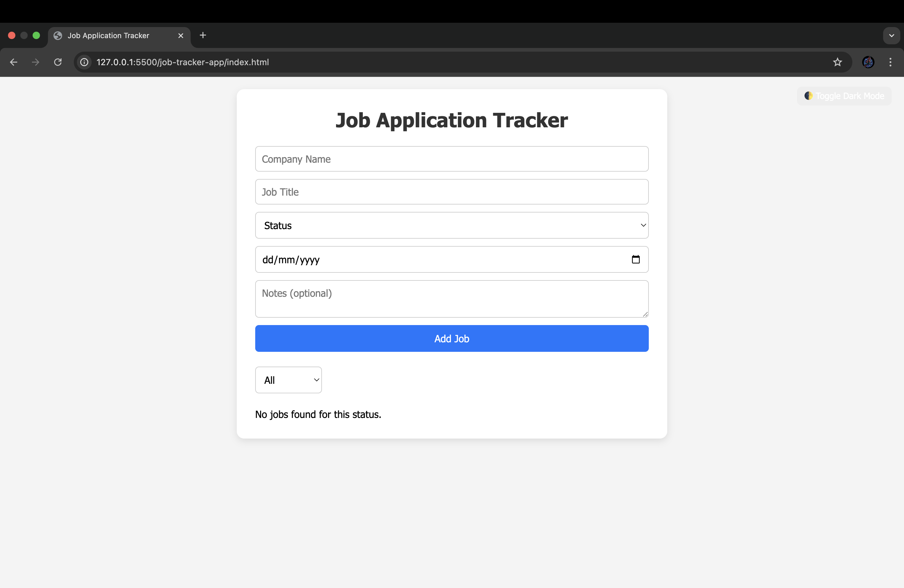
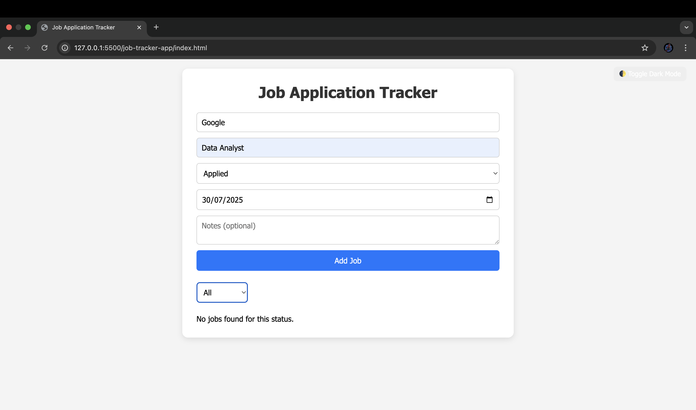
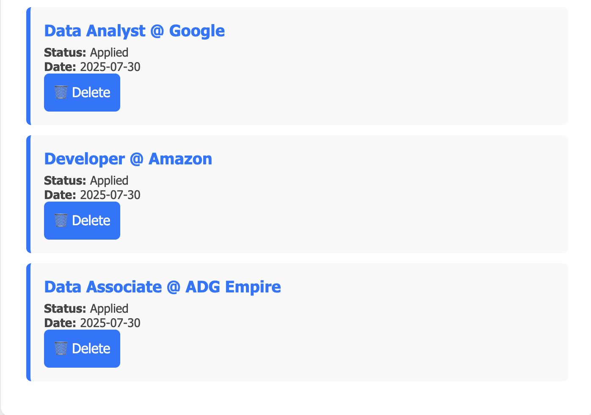
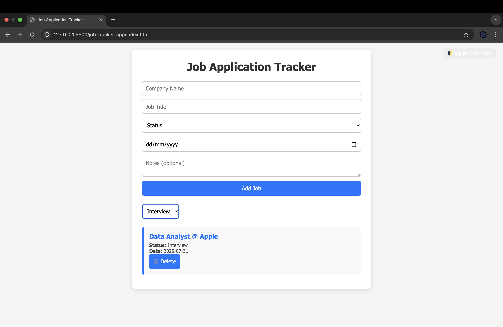
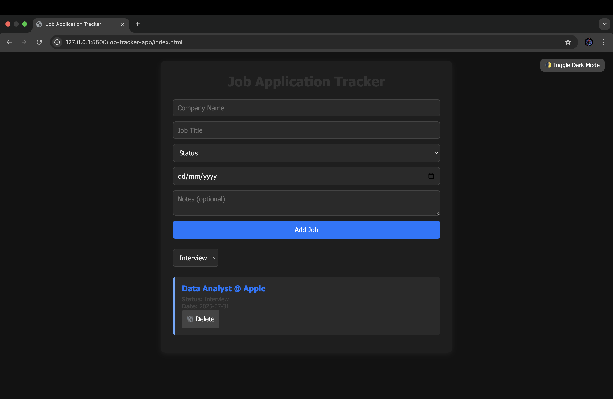

# 🧾 Job Application Tracker

A clean, minimal job tracking web app that helps users stay on top of their job applications. Built with HTML, CSS, and JavaScript. Features filtering, localStorage saving, and dark mode toggle. Perfect for job hunters 👨‍💻

---

## ✨ Features

- ✅ Add, display, and delete job entries
- 🎯 Filter by application status (`Applied`, `Interview`, `Offer`, `Rejected`)
- 💾 Data persistence using localStorage
- 🌙 Toggle between Light and Dark Mode
- 📱 Responsive & mobile-friendly layout

---

## 💻 Technologies Used

- HTML5
- CSS3
- JavaScript (Vanilla)
- localStorage

---

## 📸 Screenshots

### 🔷 Light Mode – Full Overview  


### ➕ Add Job Entry  


### 📋 Job List with Cards  


### 🗑 Delete Button  


### 🎯 Filter by Status  


### 🌑 Dark Mode View  


---

## 🚀 How to Run Locally

1. Clone the repo:
   ```bash
   git clone https://github.com/your-username/job-application-tracker.git
